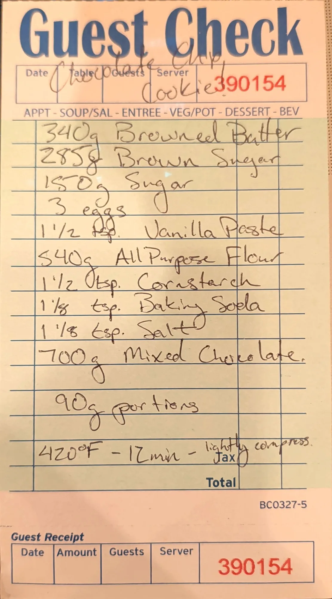

# Brown Butter Chocolate Chip Cookies

Big chocolate chip cookies on the house cookie base, made with browned butter and vanilla paste and loaded
with 700 g of mixed chocolate. Portioned at 90 g, pressed lightly and baked hot at 420 °F.

## Base dough

This is one of four cookie cards built on the same base dough: 340 g butter, 285 g brown sugar, 150 g sugar,
3 eggs, 1 1/2 tsp vanilla, flour, 1 1/2 tsp cornstarch, 1 1/8 tsp baking soda and 1 1/8 tsp salt. The cards
change the butter (plain or browned), the flour weight, the add-ins, the portion size and the bake. The row
in bold is this card.

| Card | Butter | Brown sugar | Flour | Cocoa | Add-ins | Portion | Oven | Time |
| --- | --- | ---: | ---: | ---: | --- | ---: | --- | --- |
| [Snickerdoodle](snickerdoodle-cookies.md) | 340 g | 288 g [?] | 540 g | - | 2 tsp cinnamon in the dough; rolled in brown sugar, sugar and cinnamon | 70 g | 400 °F (204 °C) | ~11 min |
| **[Brown butter chocolate chip](brown-butter-chocolate-chip-cookies.md)** | **340 g, browned** | **285 g** | **540 g all-purpose** | **-** | **700 g mixed chocolate; vanilla paste for the vanilla** | **90 g** | **420 °F (216 °C)** | **12 min** |
| [Chocolate chocolate chip](chocolate-chocolate-chip-cookies.md) | 340 g, browned | 285 g | 440 g | 80 g | 700 g chips (chocolate or Reese's peanut butter) | 90 g | 420 °F [?] (216 °C) | ~12 min |
| [Double chocolate chip](double-chocolate-chip-cookies.md) | 340 g | 285 g | 540 g | - | 700 g chocolate chips (first written 525 g) | 95-110 g [?] | 420 °F (216 °C) | 10-13 min |

## Ingredients

| Amount | Ingredient | Notes |
| ---: | --- | --- |
| 340 g | Browned butter | Card doesn't say whether this is weighed before or after browning; see Notes |
| 285 g | Brown sugar | |
| 150 g | Sugar | |
| 3 | Eggs | ~150 g out of the shell (large) |
| 1 1/2 tsp | Vanilla paste | ~9 g |
| 540 g | All-purpose flour | |
| 1 1/2 tsp | Cornstarch | ~4 g |
| 1 1/8 tsp | Baking soda | ~6 g |
| 1 1/8 tsp | Salt | ~6 g fine salt (~3.5 g if Diamond Crystal kosher) |
| 700 g | Mixed chocolate | Card doesn't say which; a mix of chips and chopped bar chocolate fits "mixed" |

## Method

Steps marked *(card)* come from the card. The rest is added; see Notes.

1. **Brown the butter.** Melt the butter in a light-colored pan over medium heat and keep cooking, swirling,
   until the milk solids turn deep brown and it smells nutty, about 8-10 minutes. Scrape it into a bowl with
   all the browned bits.
2. **Cool it.** Let the butter cool until it's no longer warm to the touch, or chill it until it's soft-set.
   Hot butter will melt the sugar and the chocolate and make the cookies spread.
3. **Sugars, eggs, vanilla.** Beat the browned butter with the brown sugar and sugar for about 2 minutes.
   Beat in the eggs one at a time, then the vanilla paste.
4. **Dry.** Whisk the flour, cornstarch, baking soda and salt together. Mix them in on low speed just until
   no dry flour is left.
5. **Chocolate.** Fold in the mixed chocolate.
6. **Portion.** *(card)* Portion into 90 g balls.
7. **Press.** *(card)* Lightly compress each ball before baking.
8. **Bake.** *(card)* Bake at 420 °F (216 °C) for 12 minutes.
9. **Cool.** Let them sit on the sheet for 5-10 minutes, then move to a rack.

## Notes

### From the original card
- The card's title is just "Chocolate Chip Cookies" (guest check No. 390154). "Brown butter" is added to the
  name here to tell it apart from the [double chocolate chip](double-chocolate-chip-cookies.md) card, which
  is the same idea with plain butter.
- The two changes from the base dough on this card: **browned** butter, and **vanilla paste** instead of
  vanilla. The flour is written as "All Purpose Flour".
- The "tsp." on the vanilla paste line is written over or scribbled; it reads as tsp [?].
- The method on the card, in full: *"90g portions. 420°F - 12min - lightly compress."*

### Added later (not on the card, confirm or edit)
- **Browning and cooling** steps, and the mixing order.
- **Butter weight.** Butter is about 15% water, and most of that cooks off when it browns. If 340 g is the
  weight before browning, you end up with roughly 290 g of browned butter. If the card means 340 g after
  browning, start with about 400 g. Weigh it before browning until a batch says otherwise, and note which
  in the Test log.
- **"Lightly compress"** is read as pressing each ball down slightly (to a thick puck) before it goes in the
  oven.
- **Gram estimates** for the spoon measures and the eggs (marked ~ above).
- **Yield.** The dough weighs about 2,140-2,190 g depending on the butter question above, which makes about
  23-24 balls at 90 g.
- **Freezing.** The section README asks whether the dough balls freeze and how they bake from frozen.
  Untested.

## Test log

| Date | Batch | Change | Result |
| --- | --- | --- | --- |
| | | | |

## Original card

