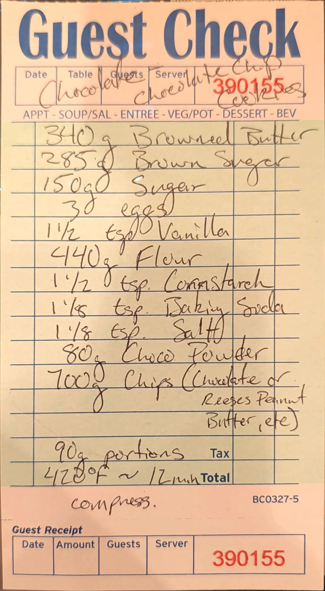

# Chocolate Chocolate Chip Cookies

A chocolate dough on the house cookie base: browned butter, 100 g less flour, 80 g of cocoa powder, and
700 g of chips. The card leaves the chips open: chocolate, Reese's peanut butter chips, or whatever else.

## Base dough

This is one of four cookie cards built on the same base dough: 340 g butter, 285 g brown sugar, 150 g sugar,
3 eggs, 1 1/2 tsp vanilla, flour, 1 1/2 tsp cornstarch, 1 1/8 tsp baking soda and 1 1/8 tsp salt. The cards
change the butter (plain or browned), the flour weight, the add-ins, the portion size and the bake. The row
in bold is this card.

| Card | Butter | Brown sugar | Flour | Cocoa | Add-ins | Portion | Oven | Time |
| --- | --- | ---: | ---: | ---: | --- | ---: | --- | --- |
| [Snickerdoodle](snickerdoodle-cookies.md) | 340 g | 288 g [?] | 540 g | - | 2 tsp cinnamon in the dough; rolled in brown sugar, sugar and cinnamon | 70 g | 400 °F (204 °C) | ~11 min |
| [Brown butter chocolate chip](brown-butter-chocolate-chip-cookies.md) | 340 g, browned | 285 g | 540 g all-purpose | - | 700 g mixed chocolate; vanilla paste for the vanilla | 90 g | 420 °F (216 °C) | 12 min |
| **[Chocolate chocolate chip](chocolate-chocolate-chip-cookies.md)** | **340 g, browned** | **285 g** | **440 g** | **80 g** | **700 g chips (chocolate or Reese's peanut butter)** | **90 g** | **420 °F [?] (216 °C)** | **~12 min** |
| [Double chocolate chip](double-chocolate-chip-cookies.md) | 340 g | 285 g | 540 g | - | 700 g chocolate chips (first written 525 g) | 95-110 g [?] | 420 °F (216 °C) | 10-13 min |

## Ingredients

| Amount | Ingredient | Notes |
| ---: | --- | --- |
| 340 g | Browned butter | Card doesn't say whether this is weighed before or after browning; see Notes |
| 285 g | Brown sugar | |
| 150 g | Sugar | |
| 3 | Eggs | ~150 g out of the shell (large) |
| 1 1/2 tsp | Vanilla | ~6 g |
| 440 g | Flour | 100 g less than the other three cards |
| 1 1/2 tsp | Cornstarch | ~4 g |
| 1 1/8 tsp | Baking soda | ~6 g |
| 1 1/8 tsp | Salt | ~6 g fine salt (~3.5 g if Diamond Crystal kosher) |
| 80 g | Cocoa powder | Written "Choco Powder" on the card; type not stated |
| 700 g | Chips | Chocolate, or Reese's peanut butter chips, etc. |

## Method

Steps marked *(card)* come from the card. The rest is added; see Notes.

1. **Brown the butter.** Melt the butter in a light-colored pan over medium heat and keep cooking, swirling,
   until the milk solids turn deep brown and it smells nutty, about 8-10 minutes. Scrape it into a bowl with
   all the browned bits.
2. **Cool it.** Let the butter cool until it's no longer warm to the touch, or chill it until it's soft-set.
3. **Sugars, eggs, vanilla.** Beat the browned butter with the brown sugar and sugar for about 2 minutes.
   Beat in the eggs one at a time, then the vanilla.
4. **Dry.** Whisk the flour, cocoa powder, cornstarch, baking soda and salt together (sift the cocoa if it's
   lumpy). Mix them in on low speed just until no dry streaks are left.
5. **Chips.** Fold in the chips.
6. **Portion.** *(card)* Portion into 90 g balls.
7. **Press.** *(card)* Compress each ball before baking.
8. **Bake.** *(card)* Bake at 420 °F (216 °C) for about 12 minutes.
9. **Cool.** Let them sit on the sheet for 5-10 minutes, then move to a rack.

## Notes

### From the original card
- Title written across the header: "Chocolate Chocolate Chip Cookies". Guest check No. 390155.
- The changes from the base dough on this card: **browned** butter, flour cut to **440 g**, and **80 g**
  cocoa powder added. Flour plus cocoa comes to 520 g, close to the 540 g of flour on the other cards.
- Chips line in full: *"700g Chips (Chocolate or Reeses Peanut Butter, etc)"*.
- The method on the card, in full: *"90g portions. 420°F ~ 12min"*, with *"compress."* written below the
  printed box. This card says "compress", not "lightly compress" like the brown butter card.
- The last digit of "420" is written over another digit. It reads as 0 [?], which matches the other two
  420 °F cards.

### Added later (not on the card, confirm or edit)
- **Browning and cooling** steps, and the mixing order.
- **Butter weight.** Butter is about 15% water, and most of that cooks off when it browns. If 340 g is the
  weight before browning, you end up with roughly 290 g of browned butter. If the card means 340 g after
  browning, start with about 400 g. Weigh it before browning until a batch says otherwise, and note which
  in the Test log.
- **Cocoa type.** The card doesn't say natural or Dutch-process. The baking soda is the same as the other
  cards, so either should work; Dutch-process gives a darker, milder cookie. Record which one you use.
- **Doneness.** The dark dough hides browning, so go by time and by set edges rather than color.
- **"Compress"** is read as pressing each ball down slightly (to a thick puck) before it goes in the oven.
- **Gram estimates** for the spoon measures and the eggs (marked ~ above).
- **Yield.** The dough weighs about 2,120-2,170 g depending on the butter question above, which makes about
  24 balls at 90 g.
- **Freezing.** The section README asks whether the dough balls freeze and how they bake from frozen.
  Untested.

## Test log

| Date | Batch | Change | Result |
| --- | --- | --- | --- |
| | | | |

## Original card

