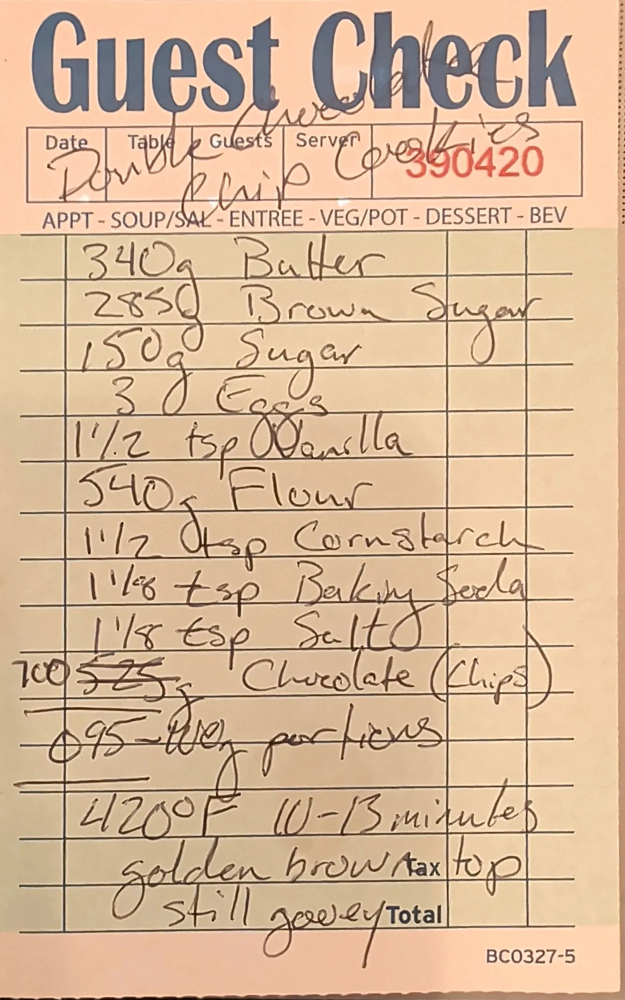

# Double Chocolate Chip Cookies

The plain-butter chocolate chip cookie on the house cookie base, with the chocolate raised from 525 g to
700 g. Big portions, baked hot until the tops are golden brown and the middles are still gooey.

## Base dough

This is one of four cookie cards built on the same base dough: 340 g butter, 285 g brown sugar, 150 g sugar,
3 eggs, 1 1/2 tsp vanilla, flour, 1 1/2 tsp cornstarch, 1 1/8 tsp baking soda and 1 1/8 tsp salt. The cards
change the butter (plain or browned), the flour weight, the add-ins, the portion size and the bake. The row
in bold is this card.

| Card | Butter | Brown sugar | Flour | Cocoa | Add-ins | Portion | Oven | Time |
| --- | --- | ---: | ---: | ---: | --- | ---: | --- | --- |
| [Snickerdoodle](snickerdoodle-cookies.md) | 340 g | 288 g [?] | 540 g | - | 2 tsp cinnamon in the dough; rolled in brown sugar, sugar and cinnamon | 70 g | 400 °F (204 °C) | ~11 min |
| [Brown butter chocolate chip](brown-butter-chocolate-chip-cookies.md) | 340 g, browned | 285 g | 540 g all-purpose | - | 700 g mixed chocolate; vanilla paste for the vanilla | 90 g | 420 °F (216 °C) | 12 min |
| [Chocolate chocolate chip](chocolate-chocolate-chip-cookies.md) | 340 g, browned | 285 g | 440 g | 80 g | 700 g chips (chocolate or Reese's peanut butter) | 90 g | 420 °F [?] (216 °C) | ~12 min |
| **[Double chocolate chip](double-chocolate-chip-cookies.md)** | **340 g** | **285 g** | **540 g** | **-** | **700 g chocolate chips (first written 525 g)** | **95-110 g [?]** | **420 °F (216 °C)** | **10-13 min** |

## Ingredients

| Amount | Ingredient | Notes |
| ---: | --- | --- |
| 340 g | Butter | |
| 285 g | Brown sugar | |
| 150 g | Sugar | |
| 3 | Eggs | ~150 g out of the shell (large) |
| 1 1/2 tsp | Vanilla | ~6 g |
| 540 g | Flour | |
| 1 1/2 tsp | Cornstarch | ~4 g |
| 1 1/8 tsp | Baking soda | ~6 g |
| 1 1/8 tsp | Salt | ~6 g fine salt (~3.5 g if Diamond Crystal kosher) |
| 700 g | Chocolate chips | First written as 525 g, crossed out and corrected to 700 g |

## Method

Steps marked *(card)* come from the card. The rest is added; see Notes.

1. **Cream.** Beat the softened butter with the brown sugar and sugar until light and fluffy, about 3 minutes.
2. **Eggs and vanilla.** Beat in the eggs one at a time, then the vanilla.
3. **Dry.** Whisk the flour, cornstarch, baking soda and salt together. Mix them in on low speed just until
   no dry flour is left.
4. **Chocolate.** Fold in the chocolate chips.
5. **Portion.** *(card)* Portion into 95-110 g balls [?].
6. **Bake.** *(card)* Bake at 420 °F (216 °C) for 10-13 minutes, until the tops are golden brown and the
   centers are still gooey.
7. **Cool.** Let them sit on the sheet for 5-10 minutes, then move to a rack.

## Notes

### From the original card
- **Title.** Read as "Double Chocolate Chip Cookies". "Double" is in the header boxes, "Chocolate" is
  written uphill across the printed "Guest Check" logo, and "Chip Cookies" sits on the line below. A long
  stroke runs through the printed "Check"; it reads as the crossbar of the "t" in "Chocolate", but if it is
  a strike-through, the title would be "Double Chip Cookies" [?]. Guest check No. 390420, from a later run
  of the pad than the other three cards (390154-390156).
- **Chocolate.** First written as **525 g**, crossed out and corrected to **700 g**. The line reads
  *"Chocolate (Chips)"*.
- **Portion.** Reads *"95-110g portions"* [?]. There is a circled mark in front of "95" and two
  hand-drawn rules, one above the line and one below it. The "110" is cramped and could also be "100".
- The method on the card, in full: *"420°F 10-13 minutes golden brown top still gooey"*.
- No instruction to compress the dough balls, unlike the brown butter and chocolate chocolate chip cards.

### Added later (not on the card, confirm or edit)
- **Mixing order.** The card lists ingredients only. Creaming softened butter with the sugars is the
  standard reading for a plain-butter dough.
- **What "double" means.** There's no cocoa in this dough, so "double" reads as the extra chocolate rather
  than a chocolate dough. Next to the [brown butter card](brown-butter-chocolate-chip-cookies.md), this one
  uses plain butter and plain vanilla, bigger portions, and a time range with a doneness cue.
- **Gram estimates** for the spoon measures and the eggs (marked ~ above).
- **Yield.** The dough weighs about 2,190 g, which makes about 20 balls at 110 g or 23 at 95 g.
- **Freezing.** The section README asks whether the dough balls freeze and how they bake from frozen.
  Untested.

## Test log

| Date | Batch | Change | Result |
| --- | --- | --- | --- |
| | | | |

## Original card

