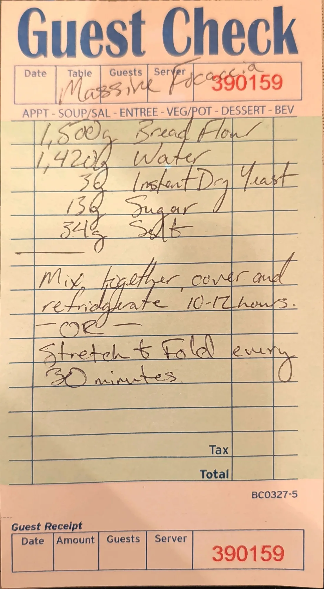

# Massive Focaccia

A big-batch, very wet focaccia dough: 1.5 kg of bread flour at about 95% hydration, with only a pinch of
yeast. The card gives two ways to develop it, a long cold rest in the fridge or stretch and folds on the
counter.

## Ingredients

| Amount | Ingredient | Notes |
| ---: | --- | --- |
| 1,500 g | Bread flour | |
| 1,420 g | Water | |
| 3 g | Instant dry yeast | |
| 13 g | Sugar | |
| 34 g | Salt | |

## Method

1. **Mix.** Mix everything together.
2. **Develop the dough.** Pick one:
   - **Method A (cold rest):** Cover and refrigerate for 10-12 hours.
   - **Method B (stretch and fold):** Stretch and fold every 30 minutes.

The card stops here. It has no pan size, shaping, bake temperature or bake time. See the suggested starting
points under *Added later* below.

## Notes

### From the original card
- Title on the card: *"Massive Focaccia"*.
- Ingredients exactly as listed: 1,500 g bread flour, 1,420 g water, 3 g instant dry yeast, 13 g sugar,
  34 g salt.
- The method on the card reads: *"Mix together, cover and refrigerate 10-12 hours. - OR - Stretch & Fold
  every 30 minutes."*
- The card does not say how many sets of stretch and folds, or for how long, in Method B.
- No olive oil is listed, and there is no pan size, bake temperature or bake time.

### Added later (not on the card, confirm or edit)
- **Hydration.** 1,420 g water / 1,500 g flour = **94.7%**. That is very wet even for focaccia (70-85% is
  more common). The 1,420 reading on the card is clear, so this looks intentional, but confirm it.
- **Baker's percentages.** Yeast 0.2%, sugar 0.9%, salt 2.3% of the flour weight.
- **Total dough.** 1,500 + 1,420 + 3 + 13 + 34 = **2,970 g**.
- **Reading of the two methods.** "Mix together" is read as applying to both methods, with the "OR"
  replacing only the fridge rest.
- **Method B starting point.** 4 sets of stretch and folds, 30 minutes apart (about 2 hours), at room
  temperature, then let it rise until roughly doubled. Not on the card.
- **Method A starting point.** After the cold rest, let the dough sit at room temperature for 1-2 hours
  before it goes into the pan so it relaxes and stretches to the corners. Not on the card.
- **Pan.** About 2,970 g of dough fits a full sheet pan (about 18 x 26 in / 46 x 66 cm), or split it
  between two half sheet pans (13 x 18 in / 33 x 46 cm). Oil the pan generously with olive oil. Not on the
  card.
- **Proof in the pan.** Stretch the dough to the corners, let it rise until puffy and jiggly (about 1-2
  hours), then oil your fingers and dimple it. Not on the card.
- **Bake.** Start at 450 °F (230 °C) for 25-35 minutes, until deep golden on top and crisp underneath.
  Two half sheets will likely bake faster than one full sheet. Not on the card.
- **Sugar.** Not traditional in focaccia; it helps browning and feeds the small amount of yeast over the
  long rest.

## Test log

| Date | Batch | Change | Result |
| --- | --- | --- | --- |
| | | | |

## Original card

