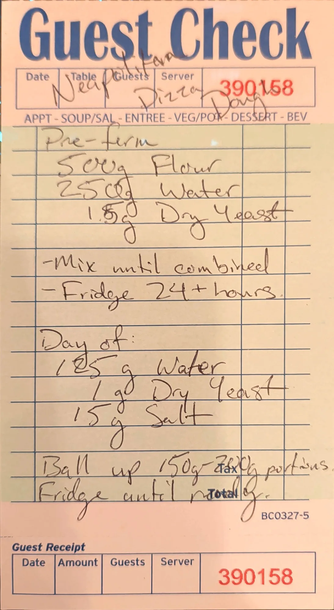

# Neapolitan Pizza Dough

A two-day pizza dough. All of the flour goes into a stiff pre-ferment that sits in the fridge for at least
a day. On the day you bake, you add the rest of the water, a little more yeast and the salt, then ball it
up and keep it cold until you're ready.

## Ingredients

### Pre-ferment

| Amount | Ingredient | Notes |
| ---: | --- | --- |
| 500 g | Flour | Type not specified on the card |
| 250 g | Water | |
| 1.5 g [?] | Dry yeast | The 5 is written over another digit, possibly an 8 |

### Day of

| Amount | Ingredient | Notes |
| ---: | --- | --- |
| 125 g [?] | Water | The 2 is written over another digit, possibly a 0 |
| 1 g | Dry yeast | |
| 15 g | Salt | |

No extra flour on the day. All 500 g of flour is in the pre-ferment.

## Method

### Pre-ferment
1. Mix the flour, water and yeast until combined.
2. Refrigerate for 24 hours or more.

### Day of
3. Add the water, yeast and salt to the pre-ferment.
4. Ball up into 150 g to 2[8?]0 g portions.
5. Refrigerate until ready.

## Notes

### From the original card
- Title on the card: *"Neapolitan Pizza Dough"*. The first section is headed *"Pre-ferm"*.
- Pre-ferment: 500 g flour, 250 g water, 1.5 g dry yeast. Method: *"Mix until combined. Fridge 24+
  hours."*
- Day of: 125 g water, 1 g dry yeast, 15 g salt. Then: *"Ball up 150 g - 2[8?]0 g portions. Fridge until
  ready."*
- **Pre-ferment yeast:** reads **1.5 g**, but the 5 is written over another digit (it looks like an 8, so
  possibly first written as 1.8 g, or the other way round).
- **Day-of water:** reads **125 g**, but the 2 is written over another digit (it looks like a 0, so
  possibly first written as 105 g).
- **No flour in the day-of list.** Read carefully: the day-of section lists only water, dry yeast and salt.
- **Upper portion size is partly hidden.** The printed "Tax" on the guest check sits on top of the second
  digit. The first digit is a clear 2 and the last is a clear 0. The middle digit looks most like an 8
  (280 g), but 250 g or 260 g can't be ruled out.
- The card does not specify the flour type, the yeast type (active dry or instant), how long to knead or
  how to bake.

### Added later (not on the card, confirm or edit)
- **Total hydration.** (250 g + 125 g) / 500 g = **75%**. If the day-of water was meant to be 105 g, it is
  71%. The pre-ferment alone is 50% hydration, which is a stiff, biga-style pre-ferment.
- **Baker's percentages.** Salt 3.0%, total yeast 2.5 g (0.5%) of the flour weight.
- **Total dough.** 500 + 250 + 1.5 + 125 + 1 + 15 = **892.5 g** (about 890 g; expect a few grams to stay
  in the bowl).
- **Number of balls:**
  - At **150 g**: 892.5 / 150 = 5.95, so **6 balls** at about 149 g each (or 5 at 150 g with about 140 g
    left over).
  - At **280 g**: 892.5 / 280 = 3.19, so **3 balls** with about 50 g left over (or 3 balls at about 298 g).
  - If the upper number is 250 g: 892.5 / 250 = 3.57, so 3 balls with about 140 g left over.
- **Flour.** Neapolitan dough is usually made with Italian 00 pizza flour. Bread flour also works.
- **Day-of mixing order.** Dissolve the day-of yeast in the day-of water, work it into the cold
  pre-ferment, then add the salt and knead until smooth and elastic (about 8-10 minutes by hand). Not on
  the card.
- **Before shaping.** Let the balls sit at room temperature for 1-2 hours before stretching so they relax.
  Not on the card.
- **Baking.** Not on the card. Bake as hot as the oven goes and record the oven, temperature and time in
  the Test log.

## Test log

| Date | Batch | Change | Result |
| --- | --- | --- | --- |
| | | | |

## Original card

