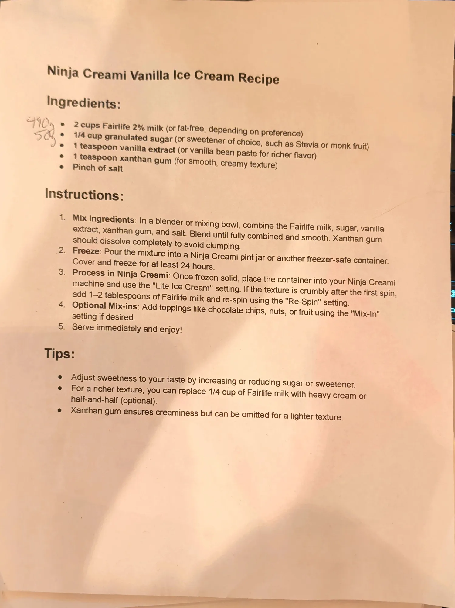

# Ninja Creami Vanilla Ice Cream

A light vanilla ice cream for the Ninja Creami, made from Fairlife 2% milk instead of cream. Blend the base,
freeze it solid in the pint jar for a day, then spin it on the Lite Ice Cream setting.

The xanthan gum does the work that fat and egg yolks do in a custard base: it keeps the spun ice cream smooth
instead of icy.

## Ingredients

| Amount | Ingredient | Notes |
| ---: | --- | --- |
| 490 g | Fairlife 2% milk | Printed as 2 cups. Fat-free also works, per the printout |
| 50 g | Granulated sugar | Printed as 1/4 cup. Or a sweetener such as stevia or monk fruit |
| 1 tsp | Vanilla extract | ~4 g. Or vanilla bean paste for a richer flavor |
| 1 tsp | Xanthan gum | ~3 g. See *Xanthan amount* below |
| Pinch | Salt | ~0.5 g |

## Method

1. **Mix.** In a blender or mixing bowl, combine the milk, sugar, vanilla, xanthan gum and salt. Blend until
   smooth and fully combined. The xanthan gum should dissolve completely so it doesn't clump.
2. **Freeze.** Pour the mixture into a Ninja Creami pint jar (or another freezer-safe container). Cover and
   freeze for at least 24 hours.
3. **Spin.** Once it's frozen solid, put the jar in the Ninja Creami and run the **Lite Ice Cream** setting.
   If the texture is crumbly after the first spin, add 1-2 tbsp of milk (~15-30 g) and run **Re-Spin**.

## To serve

- Add mix-ins like chocolate chips, nuts or fruit with the **Mix-In** setting, if you want them.
- Serve right away.

## Notes

### From the printout
- The printout gives volume measures only. The gram amounts in the Ingredients table are Ryan's handwritten
  conversions in the left margin: **490 g** next to the milk and **50 g** next to the sugar. Nothing is
  written next to the vanilla, xanthan gum or salt.
- Tips printed on the page:
  - Adjust the sweetness by adding or cutting sugar or sweetener.
  - For a richer texture, replace 1/4 cup (~60 g) of the milk with heavy cream or half-and-half.
  - The xanthan gum makes it creamy but can be left out for a lighter texture.
- The source of the printout isn't on the page.

### Added later (not on the printout, confirm or edit)
- **Gram estimates** for the vanilla, xanthan gum, salt and re-spin milk are standard conversions, not
  measured.
- **Xanthan amount.** 1 tsp (~3 g) per pint is more than many Creami recipes use (often 1/8-1/4 tsp). If the
  texture comes out gummy or slick, try cutting it back and log the change below.
- **Fill line.** The base is a little over 2 cups of liquid. Check it sits below the pint jar's max fill line
  before freezing.
- **Yield** is the sum of the ingredient weights, about 545 g, which is one pint jar.

## Test log

| Date | Batch | Change | Result |
| --- | --- | --- | --- |
| | | | |

## Original printout

