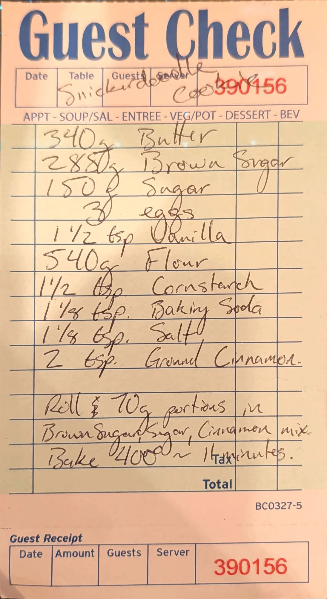

# Snickerdoodle Cookies

A snickerdoodle built on the house cookie base: plain butter, ground cinnamon in the dough, and each 70 g
ball rolled in a brown sugar, sugar and cinnamon coating before a hot, short bake at 400.

## Base dough

This is one of four cookie cards built on the same base dough: 340 g butter, 285 g brown sugar, 150 g sugar,
3 eggs, 1 1/2 tsp vanilla, flour, 1 1/2 tsp cornstarch, 1 1/8 tsp baking soda and 1 1/8 tsp salt. The cards
change the butter (plain or browned), the flour weight, the add-ins, the portion size and the bake. The row
in bold is this card.

| Card | Butter | Brown sugar | Flour | Cocoa | Add-ins | Portion | Oven | Time |
| --- | --- | ---: | ---: | ---: | --- | ---: | --- | --- |
| **[Snickerdoodle](snickerdoodle-cookies.md)** | **340 g** | **288 g [?]** | **540 g** | **-** | **2 tsp cinnamon in the dough; rolled in brown sugar, sugar and cinnamon** | **70 g** | **400 °F (204 °C)** | **~11 min** |
| [Brown butter chocolate chip](brown-butter-chocolate-chip-cookies.md) | 340 g, browned | 285 g | 540 g all-purpose | - | 700 g mixed chocolate; vanilla paste for the vanilla | 90 g | 420 °F (216 °C) | 12 min |
| [Chocolate chocolate chip](chocolate-chocolate-chip-cookies.md) | 340 g, browned | 285 g | 440 g | 80 g | 700 g chips (chocolate or Reese's peanut butter) | 90 g | 420 °F [?] (216 °C) | ~12 min |
| [Double chocolate chip](double-chocolate-chip-cookies.md) | 340 g | 285 g | 540 g | - | 700 g chocolate chips (first written 525 g) | 95-110 g [?] | 420 °F (216 °C) | 10-13 min |

## Ingredients

| Amount | Ingredient | Notes |
| ---: | --- | --- |
| 340 g | Butter | |
| 288 g [?] | Brown sugar | Last digit unclear; see Notes |
| 150 g | Sugar | |
| 3 | Eggs | ~150 g out of the shell (large) |
| 1 1/2 tsp | Vanilla | ~6 g |
| 540 g | Flour | |
| 1 1/2 tsp | Cornstarch | ~4 g |
| 1 1/8 tsp | Baking soda | ~6 g |
| 1 1/8 tsp | Salt | ~6 g fine salt (~3.5 g if Diamond Crystal kosher) |
| 2 tsp | Ground cinnamon | ~5 g |

**For rolling**

| Amount | Ingredient | Notes |
| ---: | --- | --- |
| as needed | Brown sugar, sugar and cinnamon, mixed | No amounts on the card; see Notes for a starting mix |

## Method

Steps marked *(card)* come from the card. The rest is added; see Notes.

1. **Cream.** Beat the softened butter with the brown sugar and sugar until light and fluffy, about 3 minutes.
2. **Eggs and vanilla.** Beat in the eggs one at a time, then the vanilla.
3. **Dry.** Whisk the flour, cornstarch, baking soda, salt and cinnamon together. Mix them in on low speed
   just until no dry flour is left.
4. **Portion and roll.** *(card)* Portion the dough into 70 g balls and roll each one in the brown sugar,
   sugar and cinnamon mix.
5. **Pan.** Space the balls well apart on parchment-lined sheets.
6. **Bake.** *(card)* Bake at 400 °F (204 °C) for about 11 minutes. Pull them when the edges are set and the
   centers still look a little underdone.
7. **Cool.** Let them sit on the sheet for 5 minutes, then move to a rack.

## Notes

### From the original card
- Title written across the header boxes: "Snickerdoodle Cookies". Guest check No. 390156.
- Brown sugar reads **288 g**. The last digit is crossed by the descender of the "g" on the butter line
  above, so 280 or 285 are possible readings. The other three cards in the set all say 285 g.
- The method on the card, in full: *"Roll & 70g portions in Brown Sugar, Sugar, Cinnamon mix. Bake 400 ~ 11
  minutes."* The "&" is a best reading of a small mark before "70g" [?].
- The card writes "400" with no unit. Fahrenheit is assumed; the other three cards all say °F.
- Unlike the three chocolate cards, there is no instruction to compress the dough balls.

### Added later (not on the card, confirm or edit)
- **Mixing order.** The card lists ingredients only. Creaming softened butter with the sugars is the
  standard reading for a plain-butter dough.
- **Gram estimates** for the spoon measures and the eggs (marked ~ above).
- **Rolling mix.** No amounts on the card. About 50 g brown sugar, 50 g sugar and 1 tsp cinnamon should
  coat a full batch.
- **Yield.** The dough weighs about 1,490 g, which makes about 21 balls at 70 g.
- **No cream of tartar.** Classic snickerdoodles use it for tang and a soft crumb; this card uses baking
  soda only. Leave it as written until a batch says otherwise.
- **Chill.** Not on the card. If the balls spread too much, chill them for 30 minutes before baking.
- **Freezing.** The section README asks whether the dough balls freeze and how they bake from frozen.
  Untested.

## Test log

| Date | Batch | Change | Result |
| --- | --- | --- | --- |
| | | | |

## Original card

