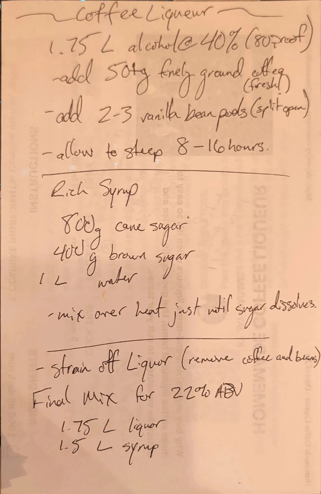

# Coffee Liqueur

A homemade coffee liqueur built on a 1.75 L bottle of spirit. Fresh fine-ground coffee and split vanilla pods
steep in 80-proof spirit overnight, then the strained spirit is cut with a cane and brown sugar syrup down to a
target of 22% ABV.

## Ingredients

### Steep

| Amount | Ingredient | Notes |
| ---: | --- | --- |
| 1.75 L | Spirit at 40% ABV (80 proof) | The card says "alcohol" and doesn't name the spirit |
| 50 g | Coffee, finely ground | Fresh |
| 2-3 | Vanilla bean pods | Split open |

### Rich syrup

| Amount | Ingredient | Notes |
| ---: | --- | --- |
| 800 g | Cane sugar | |
| 400 g | Brown sugar | |
| 1 L | Water | |

### Final mix

| Amount | Ingredient | Notes |
| ---: | --- | --- |
| 1.75 L | Strained coffee spirit | From the steep |
| 1.5 L | Rich syrup | See *Syrup left over* below |

## Method

1. **Steep.** Add the ground coffee and split vanilla pods to the spirit. Let it steep 8-16 hours.
2. **Rich syrup.** Combine the cane sugar, brown sugar and water. Heat, stirring, just until the sugar
   dissolves.
3. **Strain.** Strain the spirit to remove the coffee and vanilla beans.
4. **Final mix.** Combine 1.75 L of the strained spirit with 1.5 L of syrup, for 22% ABV.

## Notes

### From the original card
- Written on the back of another sheet. The printed "Homemade Coffee Liqueur" page showing through from the
  other side is not part of this recipe.
- The card spells it "Liquor" in the strain and final-mix steps; the title says "Coffee Liqueur".
- The card states the target as **22% ABV**. It does not say how long to keep it, how to bottle it, or which
  spirit to use.

### Added later (not on the card, confirm or edit)
- **ABV check.** 1.75 L at 40% holds 0.70 L of alcohol. Blended with 1.5 L of syrup that's 3.25 L total, and
  0.70 / 3.25 = **21.5% ABV**. That's a little under the card's 22%, which reads as the rounded figure. In
  practice it will land a bit lower still: the wet grounds hold back some spirit (roughly 100 ml for 50 g, an
  estimate), and if the strained spirit comes up short of 1.75 L the blend drops toward 21%. Measure what
  you actually strain off before mixing.
- **Yield.** About 3.25 L, a little over four 750 ml bottles.
- **Syrup left over.** 1.2 kg of sugar dissolved in 1 L of water makes roughly 1.7 L of syrup (estimate),
  so about 200 ml is left after the 1.5 L goes in.
- **Syrup ratio.** By weight the syrup is 1.2 parts sugar to 1 part water. That's heavier than a 1:1 simple
  syrup but lighter than the 2:1 usually called rich syrup.
- **Cool before mixing.** Let the syrup cool to room temperature before combining so the alcohol doesn't
  flash off.
- **Straining.** A fine-mesh sieve, then a coffee filter, gets out the fine grounds. A paper filter is slow
  with this much liquid; let it drip rather than pressing.
- **Steeping.** Covered, at room temperature. Longer steeps pull more bitterness from fine-ground coffee, so
  log where in the 8-16 hour window you stop.
- **Storage.** Bottled and sealed, out of the light. At around 21% ABV with this much sugar it keeps well
  at room temperature; flavor is best within a year.
- **For the log** (per the drinks section): the spirit used, the coffee and its grind, and the steep time.

## Test log

| Date | Batch | Change | Result |
| --- | --- | --- | --- |
| | | | |

## Original card

