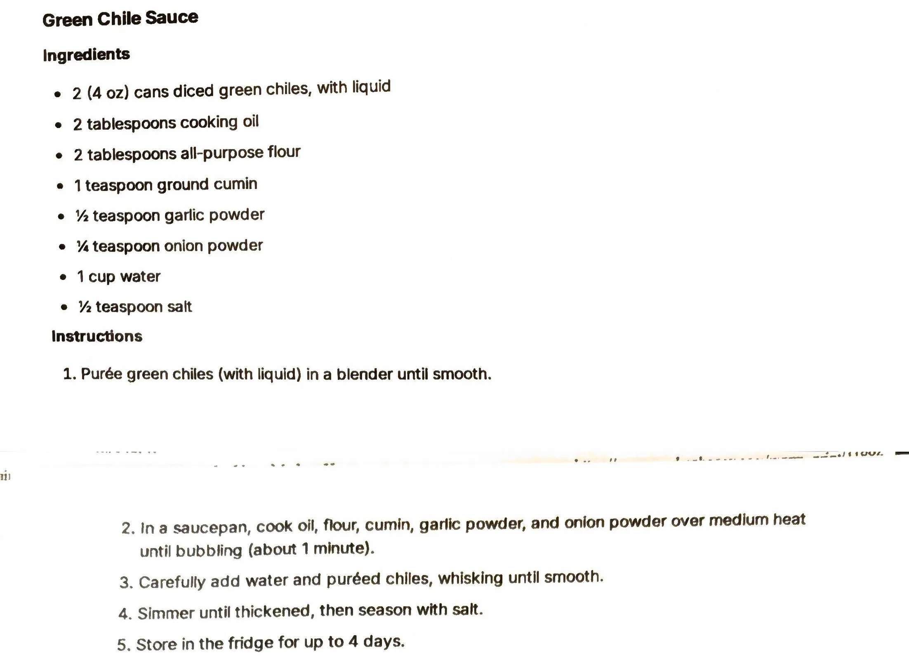

# Green Chile Sauce

An AI-generated recipe from a Perplexity chat printout, not yet made. A cooked, roux-thickened green chile
sauce, closer to an enchilada sauce than the blender sauces on the surrounding pages. Treat it as a
starting point to test, not a proven recipe.

## Ingredients

| Amount | Ingredient | Notes |
| ---: | --- | --- |
| 2 (4 oz) cans | Diced green chiles | With their liquid |
| 2 tablespoons | Cooking oil | ~28 g |
| 2 tablespoons | All-purpose flour | ~16 g |
| 1 teaspoon | Ground cumin | ~2 g |
| 1/2 teaspoon | Garlic powder | ~1.5 g |
| 1/4 teaspoon | Onion powder | ~0.75 g |
| 1 cup | Water | ~240 g |
| 1/2 teaspoon | Salt | ~3 g |

## Method

1. Purée the green chiles, with their liquid, in a blender until smooth.
2. In a saucepan, cook the oil, flour, cumin, garlic powder and onion powder over medium heat until
   bubbling, about 1 minute.
3. Carefully add the water and puréed chiles, whisking until smooth.
4. Simmer until thickened, then season with salt.

## Storage

- **Fridge:** Up to 4 days (per the printout).
- **Freezer:** Untested. This is a roux-thickened sauce, a category the freezer sauce library flags as
  likely to go grainy on thawing (see [Known limits](../README.md#known-limits)). If tested, thickening by
  reduction or with a cornstarch slurry after thawing, instead of relying on the roux, is worth trying per
  that same guidance.

## Notes

### From the printout
- Can sizes (two 4 oz cans of diced green chiles) are kept as printed rather than converted.
- The method is four steps: purée the chiles, cook the roux base, whisk in water and chiles, simmer and
  season with salt.

### Added later (not on the card, confirm or edit)
- **This whole recipe is AI-generated and untested.** It came from a Perplexity AI chat ("Give me a single
  pdf for each of the recipes"), not a tested source. Status is `testing` because it has never been made.
- **Gram estimates** for the tablespoon, teaspoon and cup measures are approximate conversions, not from the
  source. The can sizes are left as printed (4 oz each), per repo convention for canned goods.
- **Yield** (~500 g) is computed by summing the ingredient gram estimates above (each 4 oz can estimated at
  ~113 g); it is a guess, not stated on the printout.
- **Pairs-with** (enchiladas, burritos, eggs, chicken) is a best guess based on what a cooked green chile
  sauce is typically used for; the printout does not say how to serve it.
- **Category.** Filed under `chicken` rather than `cold-sauces` because it's a cooked, roux-thickened sauce,
  not a blender dressing or dip.

## Test log

| Date | Batch | Change | Result |
| --- | --- | --- | --- |
| | | | |

## Original printout

