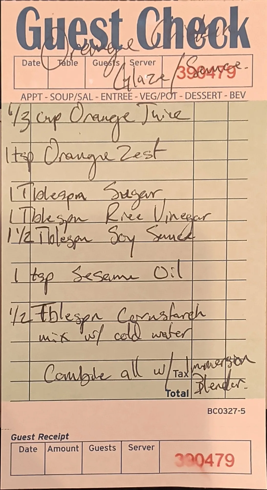

# Orange Chicken Glaze

A small-batch orange chicken sauce: orange juice and zest, soy, rice vinegar, sugar and sesame oil, with a
cornstarch slurry to give it body. Everything goes into one container and gets blitzed with an immersion
blender.

## Ingredients

| Amount | Ingredient | Notes |
| ---: | --- | --- |
| 1/3 cup | Orange juice | ~80 g |
| 1 tsp | Orange zest | ~2 g |
| 1 tbsp | Sugar | ~12 g |
| 1 tbsp | Rice vinegar | ~15 g |
| 1 1/2 tbsp | Soy sauce | ~26 g |
| 1 tsp | Sesame oil | ~4 g |
| 1/2 tbsp | Cornstarch | ~4 g. Mixed with cold water into a slurry (amount not given; see below) |

## Method

1. **Slurry.** Mix the cornstarch with cold water.
2. **Blend.** Combine everything with an immersion blender.

## Storage

- **Fridge:** Not on the card. An airtight container for up to a week is a reasonable starting point
  (added, confirm).
- **Freezer:** Untested. The freezer library's [known limits](../README.md#known-limits) say to thicken with
  a cornstarch slurry *after* thawing; a sauce thickened with cornstarch before freezing tends to weep and
  turn spongy. Freezing the base without the slurry and thickening at reheat is the likely fix. Run it
  through the [test protocol](../README.md#test-protocol) before counting on it.

## Notes

### From the original card
- Written on a guest check, titled "Orange Chicken Glaze / Sauce".
- All measures are volume (cup, tsp, tbsp). The gram figures in the Notes column are estimates.
- The method on the card is two lines: *"mix w/ cold water"* under the cornstarch, then *"Combine all w/
  immersion blender."* The card does not say to heat it.

### Added later (not on the card, confirm or edit)
- **Slurry water.** The card doesn't give an amount. About 1 tbsp (~15 g) of cold water is enough to loosen
  1/2 tbsp of cornstarch.
- **Heating to thicken.** A cornstarch slurry only thickens once it's heated. Blended cold, this is a thin
  sauce. To get a glaze, bring it to a simmer in a small pan, stirring, and cook about 1 minute until it
  turns glossy and coats a spoon. Or pour it over the chicken in a hot pan and let it bubble until it
  thickens.
- **Gram estimates** are standard volume conversions, not measured.
- **Yield** is the sum of the estimated weights plus ~15 g of slurry water, about 160 g. That's enough to
  glaze roughly 450-675 g of chicken (estimate); scale up for a freezer batch.

## Test log

| Date | Batch | Change | Result |
| --- | --- | --- | --- |
| | | | |

## Original card

