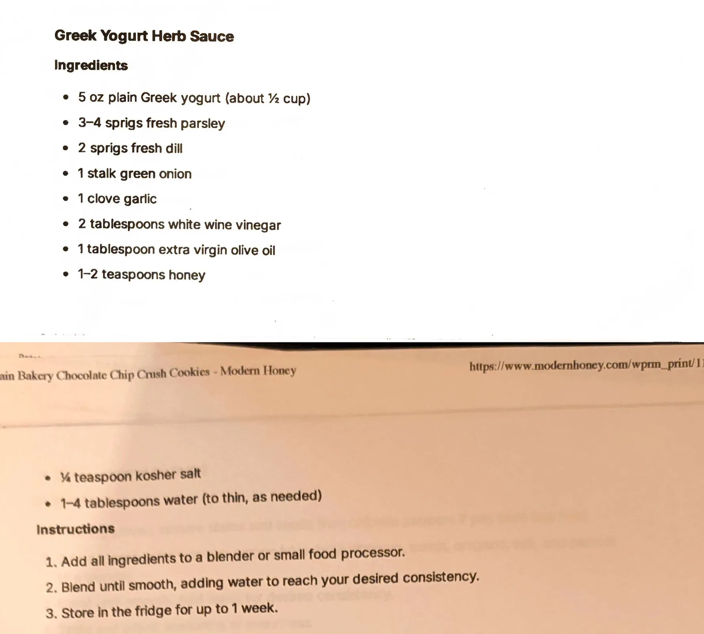

# Greek Yogurt Herb Sauce

An AI-generated recipe from a Perplexity chat printout, not yet made. A thinner, more pourable cousin of
the Green Goddess sauce on the same page: Greek yogurt loosened with vinegar and oil and blended with
parsley, dill, green onion and garlic, finished with a little honey. Treat it as a starting point to test,
not a proven recipe.

## Ingredients

| Amount | Ingredient | Notes |
| ---: | --- | --- |
| 5 oz (about 1/2 cup) | Plain Greek yogurt | ~142 g |
| 3-4 sprigs | Fresh parsley | ~4 g |
| 2 sprigs | Fresh dill | ~1 g |
| 1 stalk | Green onion | ~10 g |
| 1 clove | Garlic | ~3 g |
| 2 tablespoons | White wine vinegar | ~30 g |
| 1 tablespoon | Extra virgin olive oil | ~14 g |
| 1-2 teaspoons | Honey | ~7-14 g |
| 1/4 teaspoon [?] | Kosher salt | See *Page break* below |
| 1-4 tablespoons | Water, to thin, as needed | ~15-60 g |

## Method

1. Add all ingredients to a blender or small food processor.
2. Blend until smooth, adding water to reach your desired consistency.

## Storage

- **Fridge:** Up to 1 week (per the printout).
- **Freezer:** Untested. Cold sauces are not part of the freezer library (see the
  [cold sauces intro](../README.md)) and this is a yogurt emulsion, a category likely to separate when
  frozen.

## Notes

### From the printout
- The recipe splits across a page break: page 10 ends mid-ingredient-list at "1-2 teaspoons honey," and
  page 11 picks up with "1/4 teaspoon kosher salt" and "1-4 tablespoons water (to thin, as needed)," then
  "Instructions." **[?] A line could be missing at that page break** - there is no way to tell from the
  printout whether anything was cut between the two pages.
- The pages were stacked on top of a "Levain Bakery Chocolate Chip Crush Cookies" printout from Modern
  Honey, whose header bleeds through at the edges of the scan. That bleed-through is not part of this
  recipe.
- The method is two steps: blend everything, adding water to the desired consistency, then store in the
  fridge up to 1 week.

### Added later (not on the card, confirm or edit)
- **This whole recipe is AI-generated and untested.** It came from a Perplexity AI chat ("Give me a single
  pdf for each of the recipes"), not a tested source. Status is `testing` because it has never been made.
- **Gram estimates** for the oz, sprig, clove, tablespoon and teaspoon measures are approximate conversions,
  not from the source. A "sprig" is especially rough.
- **Yield** (~220 g before thinning water) is computed by summing the ingredient gram estimates above; it
  is a guess, not stated on the printout.
- **Pairs-with** (chicken, vegetables, pitas and wraps) is a best guess at typical uses for a thin herbed
  yogurt sauce; the printout does not say how to serve it.

## Test log

| Date | Batch | Change | Result |
| --- | --- | --- | --- |
| | | | |

## Original printout

