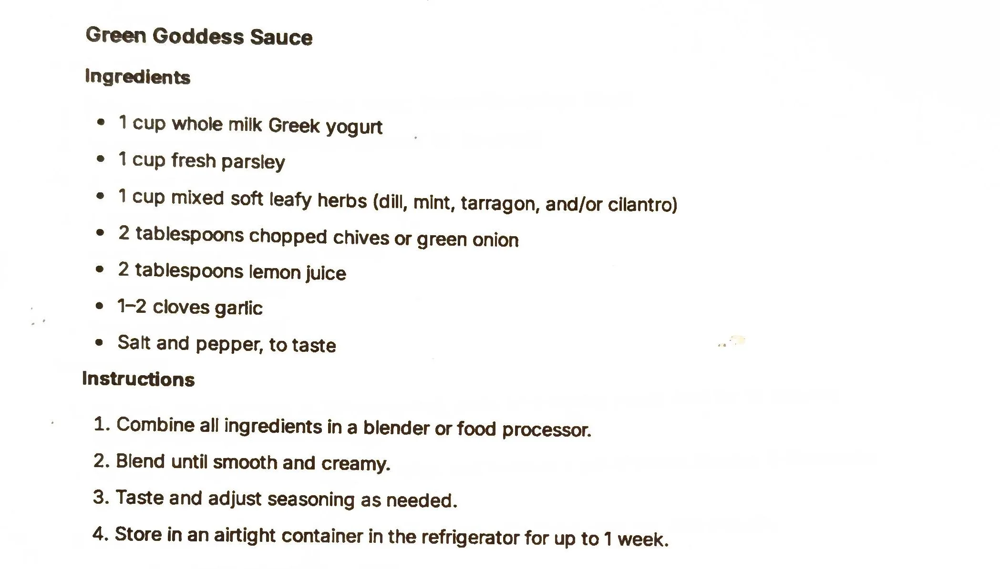

# Green Goddess Sauce

An AI-generated recipe from a Perplexity chat printout, not yet made. This is a blender herb-and-yogurt
sauce, the classic green goddess profile (parsley, soft herbs, chives, lemon) built on Greek yogurt instead
of the usual mayonnaise and sour cream. Treat it as a starting point to test, not a proven recipe.

## Ingredients

| Amount | Ingredient | Notes |
| ---: | --- | --- |
| 1 cup | Whole milk Greek yogurt | ~245 g |
| 1 cup | Fresh parsley | ~60 g |
| 1 cup | Mixed soft leafy herbs | Dill, mint, tarragon and/or cilantro; ~25 g |
| 2 tablespoons | Chopped chives or green onion | ~6 g |
| 2 tablespoons | Lemon juice | ~30 g |
| 1-2 cloves | Garlic | ~6 g |
| | Salt and pepper | To taste |

## Method

1. Combine all ingredients in a blender or food processor.
2. Blend until smooth and creamy.
3. Taste and adjust seasoning as needed.

## Storage

- **Fridge:** Airtight container, up to 1 week (per the printout).
- **Freezer:** Untested. Cold sauces are not part of the freezer library (see the
  [cold sauces intro](../README.md)) and this is a yogurt emulsion, a category likely to separate when
  frozen.

## Notes

### From the printout
- The printout gives exactly four ingredient groupings (yogurt, parsley, mixed soft herbs, chives/green
  onion) plus lemon juice, garlic and salt/pepper, and a four-step method: blend, blend until smooth, taste
  and adjust, store up to 1 week in the fridge.
- No yield, serving size or specific use is given on the printout.

### Added later (not on the card, confirm or edit)
- **This whole recipe is AI-generated and untested.** It came from a Perplexity AI chat ("Give me a single
  pdf for each of the recipes"), not a tested source. Status is `testing` because it has never been made.
- **Gram estimates** for the cup and tablespoon measures are approximate conversions, not from the source.
- **Yield** (~370 g) is computed by summing the ingredient gram estimates above; it is a guess, not stated
  on the printout.
- **Pairs-with** (salads, vegetables, chicken, sandwiches) is a best guess at typical green goddess uses;
  the printout does not say how to serve it.

## Test log

| Date | Batch | Change | Result |
| --- | --- | --- | --- |
| | | | |

## Original printout

