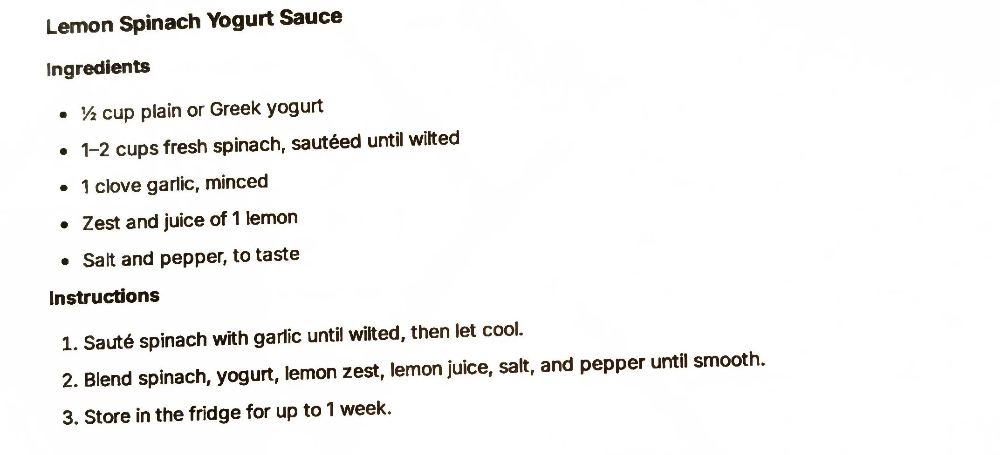

# Lemon Spinach Yogurt Sauce

An AI-generated recipe from a Perplexity chat printout, not yet made. Wilted spinach blended into yogurt
with garlic and lemon, a green sauce built for bowls and grilled proteins. Treat it as a starting point to
test, not a proven recipe.

## Ingredients

| Amount | Ingredient | Notes |
| ---: | --- | --- |
| 1/2 cup | Plain or Greek yogurt | ~120 g |
| 1-2 cups | Fresh spinach | Sautéed until wilted; ~30-60 g raw |
| 1 clove | Garlic | Minced; ~3 g |
| 1 | Lemon | Zest and juice; zest ~2 g, juice ~45 g |
| | Salt and pepper | To taste |

## Method

1. Sauté the spinach with the garlic until wilted, then let cool.
2. Blend the spinach, yogurt, lemon zest, lemon juice, salt and pepper until smooth.

## Storage

- **Fridge:** Up to 1 week (per the printout).
- **Freezer:** Untested. Cold sauces are not part of the freezer library (see the
  [cold sauces intro](../README.md)) and this is a yogurt emulsion, a category likely to separate when
  frozen.

## Notes

### From the printout
- The printout doesn't say what fat to sauté the spinach and garlic in; it just says "sauté... until
  wilted, then let cool."
- The method is two steps: sauté and cool the spinach, then blend everything until smooth; store in the
  fridge up to 1 week.

### Added later (not on the card, confirm or edit)
- **This whole recipe is AI-generated and untested.** It came from a Perplexity AI chat ("Give me a single
  pdf for each of the recipes"), not a tested source. Status is `testing` because it has never been made.
- **Gram estimates** for the cup and zest/juice measures are approximate conversions, not from the source.
- **Yield** (~215 g) is computed by summing the ingredient gram estimates above, using the low end of the
  spinach range; it is a guess, not stated on the printout.
- **Pairs-with** (chicken, fish, grain bowls, flatbread) is a best guess at typical uses for a lemony green
  yogurt sauce; the printout does not say how to serve it.
- **Sautéing fat.** Not specified on the printout; a neutral oil or a small pat of butter are both
  reasonable starting points.

## Test log

| Date | Batch | Change | Result |
| --- | --- | --- | --- |
| | | | |

## Original printout

