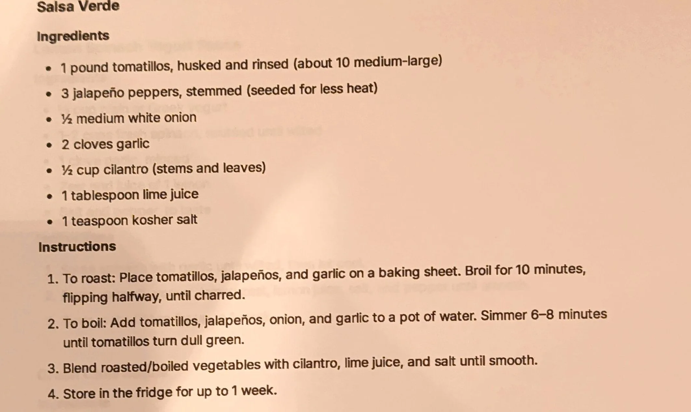

# Salsa Verde

An AI-generated recipe from a Perplexity chat printout, not yet made. A standard roasted (or boiled)
tomatillo salsa verde: tomatillos, jalapeños, onion and garlic cooked down, then blended with cilantro and
lime. Treat it as a starting point to test, not a proven recipe.

## Ingredients

| Amount | Ingredient | Notes |
| ---: | --- | --- |
| 1 pound (about 10 medium-large) | Tomatillos | Husked and rinsed; ~454 g |
| 3 | Jalapeño peppers | Stemmed, seeded for less heat; ~90 g |
| 1/2 medium | White onion | ~75 g |
| 2 cloves | Garlic | ~6 g |
| 1/2 cup | Cilantro | Stems and leaves; ~8 g |
| 1 tablespoon | Lime juice | ~15 g |
| 1 teaspoon | Kosher salt | ~6 g |

## Method

1. **To roast:** Place tomatillos, jalapeños and garlic on a baking sheet. Broil for 10 minutes, flipping
   halfway, until charred.
2. **To boil:** Add tomatillos, jalapeños, onion and garlic to a pot of water. Simmer 6-8 minutes until the
   tomatillos turn dull green.
3. Blend the roasted or boiled vegetables with the cilantro, lime juice and salt until smooth.

The printout gives both a roasting and a boiling method; it does not say which to prefer, or whether the
onion is used in the roasting method (it is only listed in the boiling step; see Notes).

## Storage

- **Fridge:** Up to 1 week (per the printout).
- **Freezer:** Untested. Cold sauces are not part of the freezer library (see the
  [cold sauces intro](../README.md)); a vegetable purée like this is more freezer-tolerant than an
  emulsion, but it hasn't been tested here.

## Notes

### From the printout
- The printout lists two alternative cooking methods (roast or boil) and does not say which one to prefer.
- **[?] The onion is only named in the "to boil" step**, not in the "to roast" step. It's unclear whether
  the onion is meant to be roasted alongside the other vegetables too, or added raw at the blending step
  regardless of method, or skipped entirely when roasting.
- Final step: blend with cilantro, lime juice and salt until smooth; store in the fridge up to 1 week.

### Added later (not on the card, confirm or edit)
- **This whole recipe is AI-generated and untested.** It came from a Perplexity AI chat ("Give me a single
  pdf for each of the recipes"), not a tested source. Status is `testing` because it has never been made.
- **Gram estimates** for the pound, tablespoon, teaspoon and cup measures are approximate conversions, not
  from the source.
- **Yield** (~650 g) is computed by summing the raw ingredient gram estimates above, before any moisture
  lost to roasting or boiling; it is a guess, not stated on the printout.
- **Pairs-with** (tacos, eggs, tortilla chips, grilled chicken) is a best guess at typical salsa verde uses;
  the printout does not say how to serve it.

## Test log

| Date | Batch | Change | Result |
| --- | --- | --- | --- |
| | | | |

## Original printout

