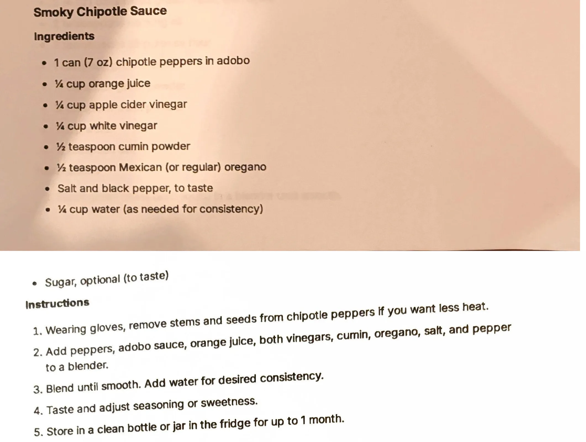

# Smoky Chipotle Sauce

An AI-generated recipe from a Perplexity chat printout, not yet made. A blended chipotle-adobo sauce, sharp
with two vinegars and orange juice, smoothed with optional sugar. Treat it as a starting point to test, not
a proven recipe.

## Ingredients

| Amount | Ingredient | Notes |
| ---: | --- | --- |
| 1 can (7 oz) | Chipotle peppers in adobo | |
| 1/4 cup | Orange juice | ~60 g |
| 1/4 cup | Apple cider vinegar | ~60 g |
| 1/4 cup | White vinegar | ~60 g |
| 1/2 teaspoon | Cumin powder | ~1 g |
| 1/2 teaspoon | Mexican (or regular) oregano | ~0.5 g |
| | Salt and black pepper | To taste |
| 1/4 cup | Water | As needed for consistency; ~60 g |
| | Sugar | Optional, to taste |

## Method

1. Wearing gloves, remove stems and seeds from the chipotle peppers if you want less heat.
2. Add the peppers, adobo sauce, orange juice, both vinegars, cumin, oregano, salt and pepper to a blender.
3. Blend until smooth. Add water for the desired consistency.
4. Taste and adjust seasoning or sweetness.

## Storage

- **Fridge:** In a clean bottle or jar, up to 1 month (per the printout).
- **Freezer:** Untested. Cold sauces are not part of the freezer library (see the
  [cold sauces intro](../README.md)); this is a blended purée, more freezer-tolerant than an emulsion, but
  it hasn't been tested here.

## Notes

### From the printout
- The can size (7 oz chipotles in adobo) is kept as printed rather than converted.
- The method is five steps: deseed if desired, blend everything but the water, add water to taste, adjust
  seasoning, store up to 1 month in a clean jar.

### Added later (not on the card, confirm or edit)
- **This whole recipe is AI-generated and untested.** It came from a Perplexity AI chat ("Give me a single
  pdf for each of the recipes"), not a tested source. Status is `testing` because it has never been made.
- **Gram estimates** for the cup and teaspoon measures are approximate conversions, not from the source. The
  can size is left as printed (7 oz), per repo convention for canned goods.
- **Yield** (~380-440 g, depending on how much thinning water is used) is computed by summing the ingredient
  gram estimates above; it is a guess, not stated on the printout.
- **Pairs-with** (tacos, bowls, chicken, sandwiches) is a best guess at typical chipotle sauce uses; the
  printout does not say how to serve it.

## Test log

| Date | Batch | Change | Result |
| --- | --- | --- | --- |
| | | | |

## Original printout

