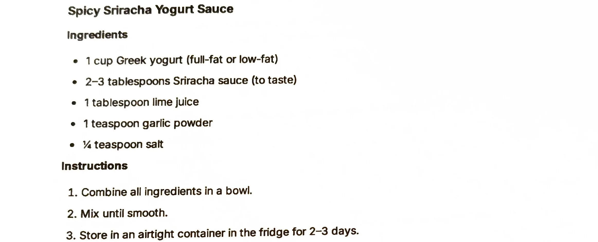

# Spicy Sriracha Yogurt Sauce

An AI-generated recipe from a Perplexity chat printout, not yet made. The simplest sauce of the set: Greek
yogurt stirred with sriracha, lime and garlic powder, no blender needed. Treat it as a starting point to
test, not a proven recipe.

## Ingredients

| Amount | Ingredient | Notes |
| ---: | --- | --- |
| 1 cup | Greek yogurt | Full-fat or low-fat; ~245 g |
| 2-3 tablespoons | Sriracha sauce | To taste; ~30-45 g |
| 1 tablespoon | Lime juice | ~15 g |
| 1 teaspoon | Garlic powder | ~3 g |
| 1/4 teaspoon | Salt | ~1.5 g |

## Method

1. Combine all ingredients in a bowl.
2. Mix until smooth.

## Storage

- **Fridge:** Airtight container, 2-3 days (per the printout).
- **Freezer:** Untested. Cold sauces are not part of the freezer library (see the
  [cold sauces intro](../README.md)) and this is a yogurt emulsion, a category likely to separate when
  frozen.

## Notes

### From the printout
- The printout gives exactly five ingredients and a two-step method: combine in a bowl, mix until smooth.
  No cooking or blending involved.
- The fridge life given (2-3 days) is noticeably shorter than the other yogurt sauces on nearby pages
  (1 week); that's what's printed, not a typo introduced here.

### Added later (not on the card, confirm or edit)
- **This whole recipe is AI-generated and untested.** It came from a Perplexity AI chat ("Give me a single
  pdf for each of the recipes"), not a tested source. Status is `testing` because it has never been made.
- **Gram estimates** for the cup, tablespoon and teaspoon measures are approximate conversions, not from the
  source.
- **Yield** (~300 g) is computed by summing the ingredient gram estimates above, using the midpoint of the
  sriracha range; it is a guess, not stated on the printout.
- **Pairs-with** (bowls, tacos, roasted vegetables, fried foods) is a best guess at typical uses for a
  sriracha yogurt sauce; the printout does not say how to serve it.

## Test log

| Date | Batch | Change | Result |
| --- | --- | --- | --- |
| | | | |

## Original printout

