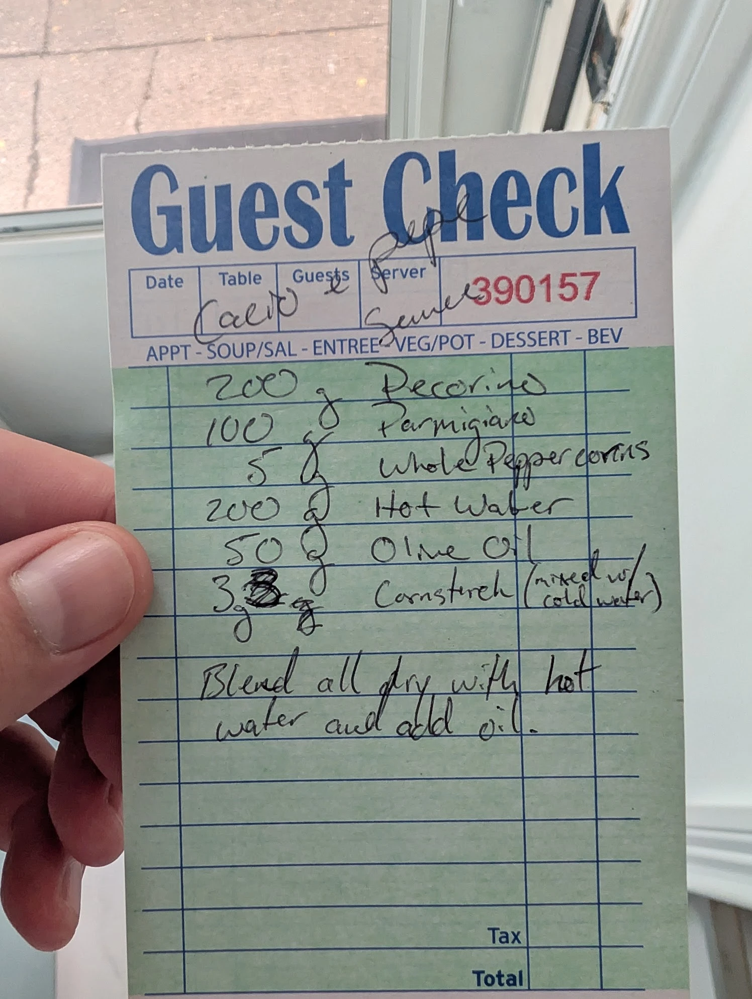

# Cacio e Pepe Sauce

A blender-made cacio e pepe base. The cheese is blended into a smooth sauce ahead of time, so at the stove
you only have to loosen it with hot pasta and pasta water. You don't have to melt grated cheese into the pan
at the last second and hope it doesn't clump.

The cornstarch is what keeps it from clumping. It holds the cheese proteins apart so the sauce stays glossy
instead of turning stringy.

## Ingredients

| Amount | Ingredient | Notes |
| ---: | --- | --- |
| 200 g | Pecorino Romano | Finely grated (microplane), room temperature |
| 100 g | Parmigiano-Reggiano | Finely grated, room temperature |
| 5 g | Whole black peppercorns | |
| 200 g | Hot water | See *Water temperature* below |
| 50 g | Olive oil | |
| 3 g | Cornstarch | Mixed with cold water into a slurry (about 15 g water) |

## Method

1. **Slurry.** Stir the cornstarch into a small splash of cold water (about 15 g) until no lumps remain.
2. **Blend the dry.** Put the pecorino, parmigiano and whole peppercorns in the blender. Pulse until the
   pepper is cracked and the cheese is a fine, even crumb.
3. **Add the hot water.** With the blender running, pour in the hot water and the slurry. Blend until smooth.
4. **Add the oil.** With the blender still running, stream in the olive oil so it emulsifies into a glossy,
   pourable sauce.

## To serve

1. Cook the pasta in less water than usual so the water you save is starchy. Save about a cup before draining.
2. Take the pan **off the heat**. Add the drained pasta and about 90–110 g of sauce per 100 g of dry pasta.
3. Toss hard, adding pasta water a spoonful at a time until the sauce coats the pasta.
4. Finish with more freshly cracked pepper and a little grated pecorino.

Don't let the sauced pasta boil or sit over direct heat. The cheese will seize and the sauce will break.

## Storage

- **Fridge:** Airtight container, 3–4 days. It will set up when cold; it loosens again with hot pasta and
  pasta water.
- **Freezer:** Untested. This is a cheese emulsion, the category the freezer sauce library flags as likely
  to separate. Run it through the [test protocol](../README.md#test-protocol) before counting on it. The
  [cacio e pepe compound butter](../compound-butters/cacio-e-pepe-butter.md) is the freezer-first version of
  this sauce.

## Notes

### From the original card
- The cornstarch was first written as **8 g** and corrected to **3 g**.
- The method on the card is one line: *"Blend all dry with hot water and add oil."* Everything else on this
  page was added later.

### Added later (not on the card, confirm or edit)
- **Water temperature.** The card just says "hot". Water that's steaming but not boiling, around
  65–75 °C (150–165 °F), is a safe starting point. Water closer to boiling can make the cheese tighten up
  and turn stringy in the blender.
- **When the slurry goes in.** The card doesn't say. Adding it with the hot water is the obvious reading.
- **Toasting the pepper (optional).** Toasting the peppercorns in a dry pan for 1–2 minutes and cooling them
  before blending gives a deeper pepper flavor. The freezer library's butter version uses toasted cracked
  pepper.
- **Serving size.** The ratio of 90–110 g sauce per 100 g dry pasta is a starting point. Adjust it after the
  next batch and record the result in the log below.

## Test log

| Date | Batch | Change | Result |
| --- | --- | --- | --- |
| | | | |

## Original card

